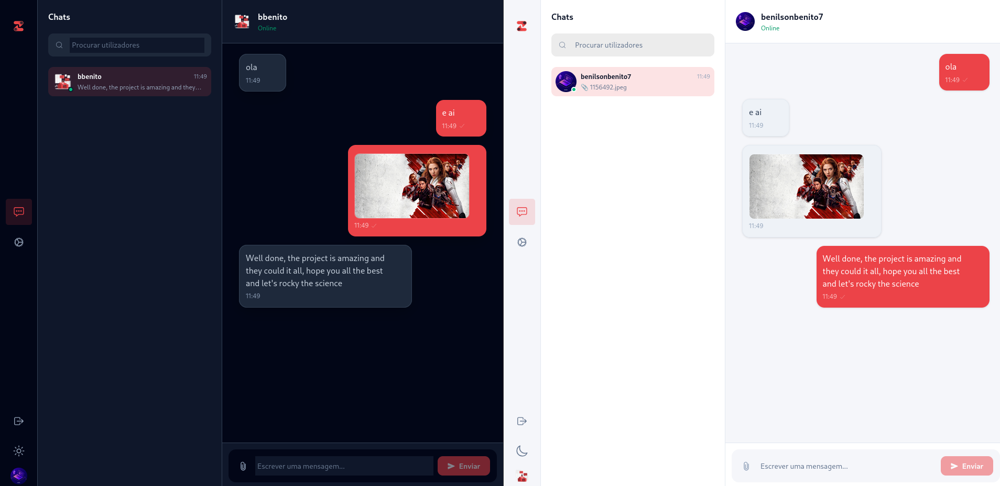
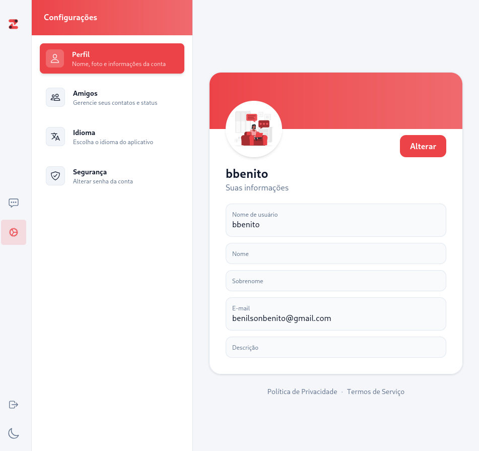
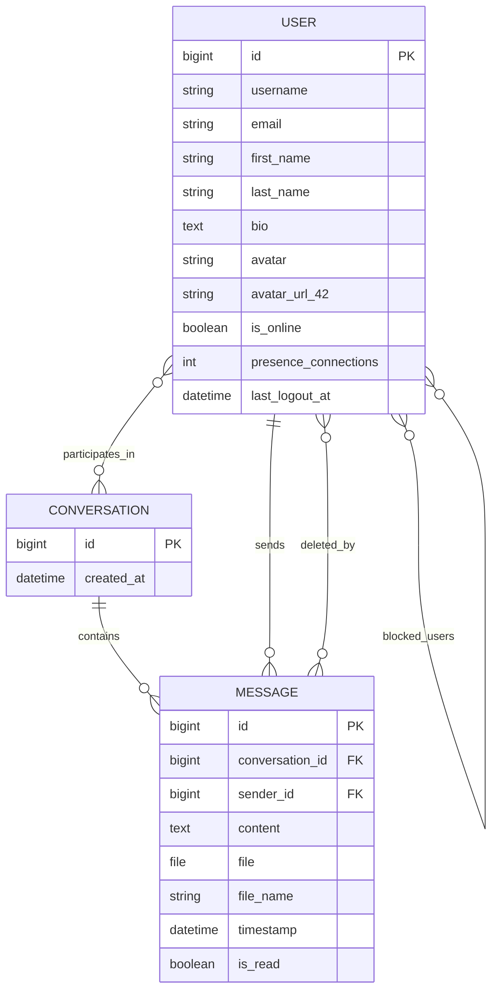

# Zyder - Real-Time Chat Platform

A full-stack real-time chat application built with modern web technologies, featuring secure authentication, WebSocket-based messaging, and a responsive user interface.

---

## 🎯 Project Overview

**Zyder** is a production-ready chat platform that demonstrates best practices in full-stack development. It combines a robust Django backend with a React frontend, providing instant messaging, user management, and presence tracking through WebSocket connections.

### Key Highlights

- **Real-time Communication**: WebSocket-powered instant messaging with read receipts
- **Secure Authentication**: JWT-based auth with OAuth2 integration (42 Intra & GitHub)
- **User Management**: Friends list, blocking, profiles, and avatar uploads
- **File Sharing**: Send files within chat messages
- **Presence Tracking**: See who's online in real-time
- **Message Control**: Delete messages for yourself or everyone
- **Responsive Design**: Mobile-friendly interface with multiple language support

---

## � Visual Preview





---

## �👥 Team

| Developer                 | Role                        | GitHub                                                 |
| ------------------------- | --------------------------- | ------------------------------------------------------ |
| **Benilson Kanza Benito** | Tech Lead, Backend          | [bbenito](https://github.com/bbenito)                  |
| **Firmino Guerra**        | Backend Developer           | [@fguerra42](https://github.com/fguerra42)             |
| **Ibraim Diarra**         | Backend Lead (WebSockets)   | [@ibraimdeveloper](https://github.com/ibraimdeveloper) |
| **Eliandra Neto**         | Frontend Developer          | [@EllyNeto](https://github.com/EllyNeto)               |
| **Daniel Vemba**          | Full-Stack, Project Manager | [@Mr-lorddev](https://github.com/Mr-lorddev)           |

---

## 🏗️ Technical Architecture

### Frontend Stack

- **React 19** with TypeScript
- **Vite** for fast development and building
- **Tailwind CSS 4** for styling
- **React Router** for navigation
- **Axios** for HTTP requests
- **i18next** for internationalization (Portuguese, English, French)

### Backend Stack

- **Django 4.2** with Django REST Framework
- **Django Channels** for WebSocket support
- **Daphne** ASGI server
- **PostgreSQL 15** for data persistence
- **Redis** for message queuing and caching
- **SimpleJWT** for token-based authentication

### Infrastructure

- **Docker & Docker Compose** for containerization
- **Nginx** reverse proxy with HTTPS support
- **CORS** configuration for frontend/backend integration

---

## 📊 Database Schema



### Main Tables

- **api_user**: Custom user model with profile information, online status, and social features
- **chat_conversation**: Private conversations between two users
- **chat_message**: Messages with optional attachments, read status, and deletion tracking

---

## ✨ Core Features

### Authentication & Security

- JWT token-based authentication with refresh tokens
- Secure logout that invalidates tokens
- OAuth 2.0 integration with 42 Intra
- OAuth 2.0 integration with GitHub
- Rate limiting on authentication endpoints
- Password reset functionality

### Chat & Messaging

- **Real-time Messages**: Instant message delivery via WebSockets
- **Read Receipts**: Track when messages are read
- **File Attachments**: Share files in conversations
- **Message Deletion**: Delete for self or for all participants
- **Typing Indicators**: See when someone is typing

### User Management

- **Profiles**: Edit bio, avatar, and user information
- **Friends**: Add/remove friends and search users
- **Blocking**: Block users to prevent communication
- **Presence**: Real-time online/offline status
- **Avatar Upload**: Support for custom user avatars

### User Experience

- **Responsive Design**: Works seamlessly on desktop and mobile
- **Multilingual**: Support for Portuguese, English, and French
- **Dark/Light Mode**: Theme switching capability
- **Settings**: Customizable language and security preferences

---

## 🚀 Getting Started

### Prerequisites

- Docker and Docker Compose
- Git
- (Optional) Node.js and npm for local frontend development
- (Optional) Python 3 and PostgreSQL for local backend development

### Environment Setup

Create a `.env` file in the project root:

```env
# Django Configuration
DJANGO_SECRET_KEY=your-secret-key-here
DJANGO_DEBUG=False
DJANGO_ALLOWED_HOSTS=localhost,127.0.0.1,your-domain.com

# PostgreSQL
POSTGRES_DB=transcendence_db
POSTGRES_USER=postgres
POSTGRES_PASSWORD=your-db-password
POSTGRES_HOST=postgres
POSTGRES_PORT=5432

# Redis
REDIS_URL=redis://redis:6379/0

# Frontend
FRONTEND_URL=http://localhost:5173

# OAuth 42 Intra
OAUTH_42_CLIENT_ID=your-42-client-id
OAUTH_42_CLIENT_SECRET=your-42-client-secret
OAUTH_42_REDIRECT_URI=http://localhost/auth/42/callback

# OAuth GitHub
GITHUB_CLIENT_ID=your-github-client-id
GITHUB_CLIENT_SECRET=your-github-client-secret
GITHUB_REDIRECT_URI=http://localhost/auth/github/callback
```

### Quick Start with Docker

```bash
# Clone the repository
git clone https://github.com/your-org/Zyder.git
cd Zyder

# Create .env file (as shown above)
# Then start the application
docker compose up --build
```

Access the application at `https://localhost` (or your configured domain)

### Local Development

#### Frontend

```bash
cd frontend
npm install
npm run dev
```

#### Backend

```bash
cd backend/app
python manage.py migrate
python manage.py runserver
```

---

## 📁 Project Structure

```
.
├── backend/                 # Django application
│   ├── app/
│   │   ├── api/            # User auth and management
│   │   ├── chat/           # Chat and WebSocket logic
│   │   ├── config/         # Django configuration
│   │   └── manage.py       # Django management
│   ├── requirements.txt    # Python dependencies
│   └── docker/             # Backend Docker setup
│
├── frontend/               # React application
│   ├── src/
│   │   ├── components/     # Reusable React components
│   │   ├── pages/          # Page components
│   │   ├── utils/          # Helper functions and hooks
│   │   └── App.tsx         # Root component
│   ├── package.json        # Node.js dependencies
│   └── Dockerfile          # Frontend Docker setup
│
├── nginx/                  # Nginx reverse proxy
│   ├── nginx.conf          # Nginx configuration
│   └── Dockerfile          # Nginx Docker setup
│
├── docker-compose.yml      # Docker Compose orchestration
├── Makefile                # Build automation
└── README.md               # Original project documentation
```

---

## 🔄 Data Flow

### Authentication Flow

1. User registers or logs in via email or OAuth
2. Backend validates credentials and issues JWT token
3. Frontend stores token in secure storage
4. Subsequent requests include token in Authorization header
5. Backend validates token before processing requests

### Real-Time Chat Flow

1. User connects via WebSocket after authentication
2. Presence system updates user's online status
3. Message sent through WebSocket connection
4. Backend broadcasts to recipient's active connections
5. Recipient receives message in real-time
6. Read receipt sent back to sender

### File Upload Flow

1. User selects file in chat interface
2. Frontend sends multipart request with message data
3. Backend stores file and creates message record
4. WebSocket event notifies all conversation participants
5. Frontend displays file in message thread

---

## 🛡️ Security Features

- **JWT Authentication**: Stateless token-based auth
- **Token Expiration**: Automatic token refresh mechanism
- **CORS Protection**: Cross-origin request validation
- **Rate Limiting**: Protect against brute force attacks
- **Secure WebSocket (WSS)**: Encrypted WebSocket connections
- **HTTPS/SSL**: Encrypted data transmission
- **SQL Injection Protection**: Django ORM parameterized queries
- **CSRF Protection**: Django CSRF middleware

---

## 📚 API Documentation

The backend provides a RESTful API with the following main endpoints:

### Authentication

- `POST /api/auth/register/` - Create new account
- `POST /api/auth/login/` - Login with credentials
- `POST /api/auth/logout/` - Logout and invalidate token
- `POST /api/auth/token/refresh/` - Refresh JWT token
- `POST /api/auth/oauth/42/` - OAuth 42 login
- `POST /api/auth/oauth/github/` - OAuth GitHub login

### Users

- `GET /api/users/` - List users
- `GET /api/users/{id}/` - Get user profile
- `PATCH /api/users/{id}/` - Update profile
- `POST /api/users/{id}/avatar/` - Upload avatar
- `GET /api/users/{id}/friends/` - Get friends list

### Conversations

- `GET /api/conversations/` - List conversations
- `POST /api/conversations/` - Create conversation
- `GET /api/conversations/{id}/messages/` - Get messages

### Messages

- `POST /api/messages/` - Send message
- `PATCH /api/messages/{id}/` - Update message
- `DELETE /api/messages/{id}/` - Delete message

---

## 🧪 Testing

### Backend Testing

```bash
cd backend/app
python manage.py test
```

### Frontend Testing

```bash
cd frontend
npm test
```

---

## 🔧 Troubleshooting

### Common Issues

**Connection refused errors**

- Ensure all services are running: `docker compose ps`
- Check that ports aren't already in use
- Verify `.env` configuration

**WebSocket connection errors**

- Ensure Redis is running
- Check WebSocket URL in frontend configuration
- Verify Nginx is properly proxying WebSocket connections

**Database errors**

- Run migrations: `python manage.py migrate`
- Check database credentials in `.env`
- Ensure PostgreSQL container is healthy

---

## 📖 Resources & Documentation

- [Django Documentation](https://docs.djangoproject.com/)
- [Django REST Framework](https://www.django-rest-framework.org/)
- [Django Channels](https://channels.readthedocs.io/)
- [React Documentation](https://react.dev/)
- [Vite Guide](https://vite.dev/)
- [WebSocket Protocol](https://tools.ietf.org/html/rfc6455)
- [JWT Introduction](https://jwt.io/introduction)
- [PostgreSQL Docs](https://www.postgresql.org/docs/)
- [Redis Documentation](https://redis.io/docs/)

---

## 📝 Contributing

We welcome contributions! Here's how to get started:

1. Fork the repository
2. Create a feature branch (`git checkout -b feature/AmazingFeature`)
3. Commit your changes (`git commit -m 'Add some AmazingFeature'`)
4. Push to the branch (`git push origin feature/AmazingFeature`)
5. Open a Pull Request

---

## 📄 License

This project is open source and available under the MIT License.

---

## 🙏 Acknowledgments

This project was built as a collaborative effort by a dedicated team of developers. Special thanks to:

- The open-source community for amazing libraries and tools
- PostgreSQL, Redis, and Django communities
- React and Vite communities for excellent developer experience

---

**Built with ❤️ by the Zyder team**

For questions or suggestions, feel free to reach out to any of the team members via their GitHub profiles.
